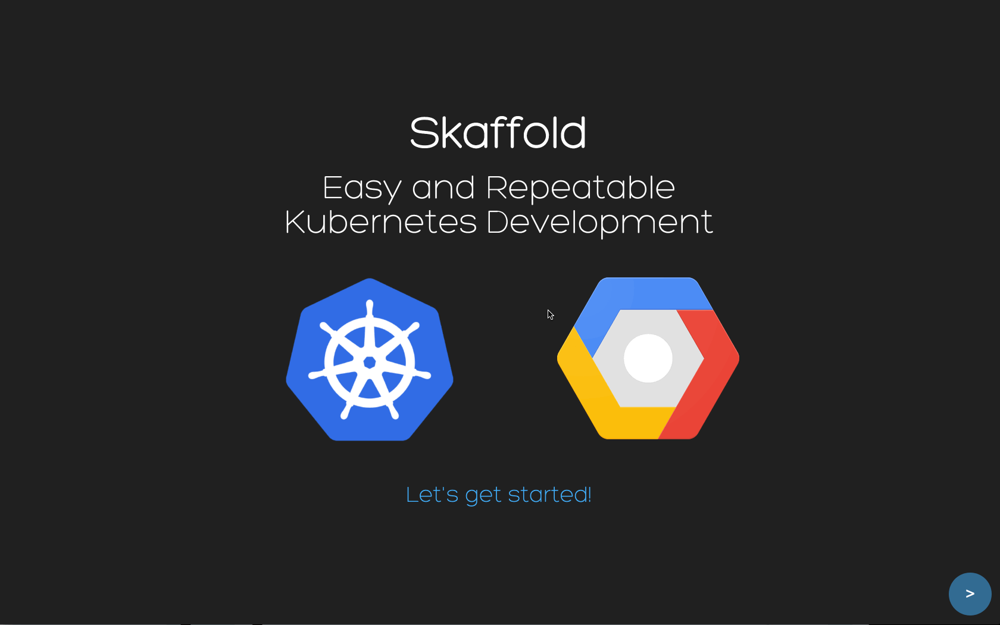

<!-- github does not support `width` with markdown images-->

---------------------

Skaffold is a command line tool that facilitates continuous development for
Kubernetes applications. You can iterate on your application source code
locally then deploy to local or remote Kubernetes clusters. Skaffold handles
the workflow for building, pushing and deploying your application. It also
provides building blocks and describe customizations for a CI/CD pipeline.

---------------------

## [Install Skaffold](https://skaffold.dev/docs/install/)

Or, check out our [Github Releases](https://github.com/GoogleContainerTools/skaffold/releases) page for release info or to install a specific version.

## Features

* Blazing fast local development
  * **optimized source-to-deploy** - Skaffold detects changes in your source code and handles the pipeline to
  **build**, **push**, and **deploy** your application automatically with **policy based image tagging**
  * **continuous feedback** - Skaffold automatically aggregates logs from deployed resources and forwards container ports to your local machine
* Project portability
  * **share with other developers** - Skaffold is the easiest way to **share your project** with the world: `git clone` and `skaffold run`
  * **context aware** - use Skaffold profiles, user level config, environment variables and flags to describe differences in environments
  * **CI/CD building blocks** - use `skaffold run` end-to-end, or use individual Skaffold phases to build up your CI/CD pipeline. `skaffold render` outputs hydrated Kubernetes manifests that can be used in GitOps workflows.
* Pluggable, declarative configuration for your project
  * **skaffold init** - Skaffold discovers your files and generates its own config file
  * **multi-component apps** - Skaffold supports applications consisting of multiple components
  * **bring your own tools** - Skaffold has a pluggable architecture to integrate with any build or deploy tool
* Lightweight
  * **client-side only** - Skaffold has no cluster-side component, so there is no overhead or maintenance burden
  * **minimal pipeline** - Skaffold provides an opinionated, minimal pipeline to keep things simple

### Check out our [examples page](./examples) for more complex workflows!

## Contributing to Skaffold

We welcome any contributions from the community with open arms - Skaffold wouldn't be where it is today without contributions from the community! Have a look at our [contribution guide](./CONTRIBUTING.md) for more information on how to get started on sending your first PR.

## Community

**Come hang out with us!**

* We're always around on [#skaffold on Kubernetes Slack](https://kubernetes.slack.com/messages/CABQMSZA6/)
* [skaffold-users mailing list](https://groups.google.com/forum/#!forum/skaffold-users)
* Have something you want us to hear? [Give us feedback!](https://skaffold.dev/docs/resources/feedback/)

**Office Hours**

We hold open office hours every other Wednesday at 9:30 AM Pacific Time. This is an open forum for anyone to show up and bring ideas, concerns, or just in general come hang out with the team! This is also a great time to get direct feedback on contributions, or give us feedback on ways you think we can improve the project. Come show us how you're using Skaffold!

Join the [skaffold-users mailing list](https://groups.google.com/forum/#!forum/skaffold-users) to get the calendar invite directly on your calendar.
You can access the hangouts invite directly from this calendar invite.

**Survey**

Your feedback is very valuable to us! We have an anonymous user feedback survey - please help us by spending a quick 5 minutes to tell us how satisfied you are with Skaffold, and what improvements we should make! You can also run `skaffold survey` from your terminal to open the survey directly in your default browser.

Survey Link - https://forms.gle/BMTbGQXLWSdn7vEs6

## Support 

Skaffold is generally available and considered production ready.
Detailed feature maturity information and how we deprecate features are described in our [Deprecation Policy](https://skaffold.dev/docs/references/deprecation).
